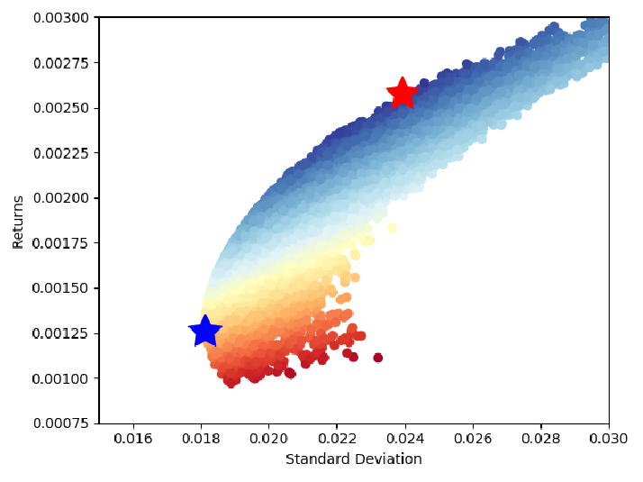

#Portfolio Optimization Using Monte Carlo Simulation
I used 20000 portfolios that are generated randomly for my
favorite stocks : 
* Amazon 
* Google 
* Tesla
* Facebook

Annual Return = Daily Return * 252 Annual Standard Deviation = Daily Standard Deviation * 252

After doing the simulation highest sharpe ratio is obtained
## Efficient Frontier


## results
```
Symbols        AMZN      FB     GOOG    TSLA
Date                                        
2017-12-01  1162.35  175.10  1010.17   61.31
2017-12-04  1133.95  171.47   998.68   61.04
2017-12-05  1141.57  172.83  1005.15   60.74
2017-12-06  1152.35  176.06  1018.38   62.65
2017-12-07  1159.79  180.14  1030.93   62.25
2017-12-08  1162.00  179.00  1037.05   63.03
2017-12-11  1168.92  179.04  1041.10   65.78
2017-12-12  1165.08  176.96  1040.48   68.21
2017-12-13  1164.13  178.30  1040.61   67.81
2017-12-14  1174.26  178.39  1049.15   67.58
2017-12-15  1179.14  180.18  1064.19   68.69
2017-12-18  1190.58  180.82  1077.14   67.77
2017-12-19  1187.38  179.51  1070.68   66.22
2017-12-20  1177.62  177.89  1064.95   65.80
2017-12-21  1174.76  177.45  1063.63   66.33
2017-12-22  1168.36  177.20  1060.12   65.04
2017-12-26  1176.76  175.99  1056.74   63.46
2017-12-27  1182.26  177.62  1049.37   62.33
2017-12-28  1186.10  177.92  1048.14   63.07
2017-12-29  1169.47  176.46  1046.40   62.27
2018-01-02  1189.01  181.42  1065.00   64.11
2018-01-03  1204.20  184.67  1082.48   63.45
2018-01-04  1209.59  184.33  1086.40   62.92
2018-01-05  1229.14  186.85  1102.23   63.32
2018-01-08  1246.87  188.28  1106.94   67.28
2018-01-09  1252.70  187.87  1106.26   66.74
2018-01-10  1254.33  187.84  1102.61   66.96
2018-01-11  1276.68  187.77  1105.52   67.59
2018-01-12  1305.20  179.37  1122.26   67.24
2018-01-16  1304.86  178.39  1121.76   68.01
...             ...     ...      ...     ...
2020-07-22  3099.91  239.87  1568.49  318.47
2020-07-23  2986.55  232.60  1515.68  302.61
2020-07-24  3008.91  230.71  1511.87  283.40
2020-07-27  3055.21  233.50  1530.20  307.92
2020-07-28  3000.33  230.12  1500.34  295.30
2020-07-29  3033.53  233.29  1522.02  299.82
2020-07-30  3051.88  234.50  1531.45  297.50
2020-07-31  3164.68  253.67  1482.96  286.15
2020-08-03  3111.89  251.96  1474.45  297.00
2020-08-04  3138.83  249.83  1464.97  297.40
2020-08-05  3205.03  249.12  1473.61  297.00
2020-08-06  3225.00  265.28  1500.10  297.92
2020-08-07  3167.46  268.44  1494.49  290.54
2020-08-10  3148.16  263.00  1496.10  283.71
2020-08-11  3080.67  256.13  1480.32  274.88
2020-08-12  3162.24  259.89  1506.62  310.95
2020-08-13  3161.02  261.30  1518.45  324.20
2020-08-14  3148.02  261.24  1507.73  330.14
2020-08-17  3182.41  261.16  1517.98  367.13
2020-08-18  3312.49  262.34  1558.60  377.42
2020-08-19  3260.48  262.59  1547.53  375.71
2020-08-20  3297.37  269.01  1581.75  400.37
2020-08-21  3284.72  267.01  1580.42  410.00
2020-08-24  3307.46  271.39  1588.20  402.84
2020-08-25  3346.49  280.82  1608.22  404.67
2020-08-26  3441.85  303.91  1652.38  430.63
2020-08-27  3400.00  293.22  1634.33  447.75
2020-08-28  3401.80  293.66  1644.41  442.68
2020-08-31  3450.96  293.20  1634.18  498.32
2020-09-01  3499.12  295.44  1660.71  475.05

[692 rows x 4 columns]
Symbols     AMZN    FB  GOOG   TSLA
Date                               
2017-12-01   NaN   NaN   NaN    NaN
2017-12-04 -2.44 -2.07 -1.14  -0.43
2017-12-05  0.67  0.79  0.65  -0.49
2017-12-06  0.94  1.87  1.32   3.15
2017-12-07  0.65  2.32  1.23  -0.64
2017-12-08  0.19 -0.63  0.59   1.25
2017-12-11  0.60  0.02  0.39   4.37
2017-12-12 -0.33 -1.16 -0.06   3.68
2017-12-13 -0.08  0.76  0.01  -0.59
2017-12-14  0.87  0.05  0.82  -0.34
2017-12-15  0.42  1.00  1.43   1.65
2017-12-18  0.97  0.36  1.22  -1.33
2017-12-19 -0.27 -0.72 -0.60  -2.29
2017-12-20 -0.82 -0.90 -0.54  -0.64
2017-12-21 -0.24 -0.25 -0.12   0.81
2017-12-22 -0.54 -0.14 -0.33  -1.95
2017-12-26  0.72 -0.68 -0.32  -2.43
2017-12-27  0.47  0.93 -0.70  -1.78
2017-12-28  0.32  0.17 -0.12   1.19
2017-12-29 -1.40 -0.82 -0.17  -1.27
2018-01-02  1.67  2.81  1.78   2.95
2018-01-03  1.28  1.79  1.64  -1.02
2018-01-04  0.45 -0.18  0.36  -0.83
2018-01-05  1.62  1.37  1.46   0.62
2018-01-08  1.44  0.77  0.43   6.26
2018-01-09  0.47 -0.22 -0.06  -0.81
2018-01-10  0.13 -0.02 -0.33   0.33
2018-01-11  1.78 -0.04  0.26   0.94
2018-01-12  2.23 -4.47  1.51  -0.51
2018-01-16 -0.03 -0.55 -0.04   1.14
...          ...   ...   ...    ...
2020-07-22 -1.22 -0.78  0.65   1.53
2020-07-23 -3.66 -3.03 -3.37  -4.98
2020-07-24  0.75 -0.81 -0.25  -6.35
2020-07-27  1.54  1.21  1.21   8.65
2020-07-28 -1.80 -1.45 -1.95  -4.10
2020-07-29  1.11  1.38  1.45   1.53
2020-07-30  0.60  0.52  0.62  -0.78
2020-07-31  3.70  8.17 -3.17  -3.81
2020-08-03 -1.67 -0.67 -0.57   3.79
2020-08-04  0.87 -0.85 -0.64   0.13
2020-08-05  2.11 -0.28  0.59  -0.13
2020-08-06  0.62  6.49  1.80   0.31
2020-08-07 -1.78  1.19 -0.37  -2.48
2020-08-10 -0.61 -2.03  0.11  -2.35
2020-08-11 -2.14 -2.61 -1.05  -3.11
2020-08-12  2.65  1.47  1.78  13.12
2020-08-13 -0.04  0.54  0.79   4.26
2020-08-14 -0.41 -0.02 -0.71   1.83
2020-08-17  1.09 -0.03  0.68  11.20
2020-08-18  4.09  0.45  2.68   2.80
2020-08-19 -1.57  0.10 -0.71  -0.45
2020-08-20  1.13  2.44  2.21   6.56
2020-08-21 -0.38 -0.74 -0.08   2.41
2020-08-24  0.69  1.64  0.49  -1.75
2020-08-25  1.18  3.47  1.26   0.45
2020-08-26  2.85  8.22  2.75   6.42
2020-08-27 -1.22 -3.52 -1.09   3.97
2020-08-28  0.05  0.15  0.62  -1.13
2020-08-31  1.45 -0.16 -0.62  12.57
2020-09-01  1.40  0.76  1.62  -4.67

[692 rows x 4 columns]
mean-returns:
Symbols
AMZN    0.001804
FB      0.001042
GOOG    0.000904
TSLA    0.003830
dtype: float64
cov_matrix:
Symbols      AMZN        FB      GOOG      TSLA
Symbols                                        
AMZN     0.000417  0.000297  0.000271  0.000332
FB       0.000297  0.000563  0.000317  0.000327
GOOG     0.000271  0.000317  0.000368  0.000318
TSLA     0.000332  0.000327  0.000318  0.001743
        ret     stdev    sharpe      GOOG        FB      TSLA      AMZN
0  0.001853  0.019892  0.093170  0.331818  0.135743  0.316521  0.215919
1  0.001355  0.018821  0.072015  0.249540  0.349634  0.339886  0.060940
2  0.002110  0.023436  0.090022  0.052282  0.256593  0.307275  0.383850
3  0.001229  0.019594  0.062746  0.048064  0.457734  0.419434  0.074768
4  0.002092  0.022899  0.091348  0.095174  0.160436  0.375324  0.369066
            ret     stdev    sharpe      GOOG        FB      TSLA      AMZN
19995  0.002588  0.024902  0.103918  0.417165  0.017963  0.118635  0.446238
19996  0.002102  0.021521  0.097677  0.324681  0.188387  0.186292  0.300641
19997  0.002140  0.022190  0.096446  0.253860  0.195671  0.215400  0.335068
19998  0.001496  0.018685  0.080079  0.360305  0.270988  0.289984  0.078722
19999  0.002442  0.023294  0.104824  0.490339  0.139778  0.001823  0.368060
The portfolio for max Sharpe Ratio:
ret       0.002575
stdev     0.023917
sharpe    0.107686
GOOG      0.601205
FB        0.009858
TSLA      0.003160
AMZN      0.385778
Name: 13239, dtype: float64
The portfolio for min risk:
ret       0.001261
stdev     0.018117
sharpe    0.069577
GOOG      0.364075
FB        0.057891
TSLA      0.570973
AMZN      0.007061
Name: 17253, dtype: float64
```

